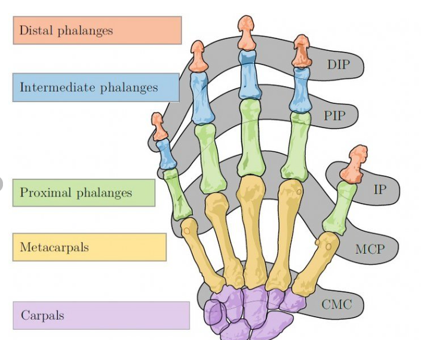

# 指 curl 値を用いた関節モーション生成の要件定義

（LucidGloves / シリアル入力 → SteamVR 手モデル）

## 1. 背景・目的

本システムは、LucidGloves のポテンショメータ生値を **シリアル通信で Unity に直接取り込み**、  
指単位の 1 次元センサ値から **curl 値（0〜1）** を生成し、  
SteamVR 手モデルの各関節（MCP / PIP / DIP、親指は CMC / MCP / IP）を駆動して  
**ピアノ演奏時の指の形状・動きに近いモーションを生成する**ことを目的とする。

ここでいう curl 値は「縦方向の屈曲のみ」を表す 1 次元センサ値であり、横方向（外転・内転）は扱わない前提とする。

補足:

- SteamVR_Behaviour_Skeleton が提供する `fingerCurls` は、  
  本仕様では **メイン経路としては使用せず**、将来的な別入力ソースとして扱う。  
- 視覚側 (`HandVisualFromCurl`) は、「0〜1 の curl 値」を唯一の入力とし、  
  入力源がシリアルか SteamVR_Skeleton かを意識しない。

---

## 2. 対象モデルと関節対応

末端（指尖）→ DIP → PIP → MCP → CMC の順。`_l` は左右反転のみ。

| ボーン名                 | 解剖学的部位 / 役割                 |
|--------------------------|--------------------------------------|
| finger_thumb_r_end       | 親指 指尖（tip）                    |
| finger_thumb_2_r         | 親指 IP（PIP/DIP 相当）             |
| finger_thumb_1_r         | 親指 MCP                             |
| finger_thumb_0_r         | 親指 CMC                             |
| finger_index_r_end       | 示指 指尖（tip）                     |
| finger_index_2_r         | 示指 DIP                              |
| finger_index_1_r         | 示指 PIP                              |
| finger_index_0_r         | 示指 MCP                              |
| finger_index_meta_r      | 示指 CMC                             |
| finger_middle_r_end      | 中指 指尖（tip）                     |
| finger_middle_2_r        | 中指 DIP                              |
| finger_middle_1_r        | 中指 PIP                              |
| finger_middle_0_r        | 中指 MCP                              |
| finger_middle_meta_r     | 中指 CMC                             |
| finger_ring_r_end        | 薬指 指尖（tip）                     |
| finger_ring_2_r          | 薬指 DIP                              |
| finger_ring_1_r          | 薬指 PIP                              |
| finger_ring_0_r          | 薬指 MCP                              |
| finger_ring_meta_r       | 薬指 CMC                             |
| finger_pinky_r_end       | 小指 指尖（tip）                     |
| finger_pinky_2_r         | 小指 DIP                              |
| finger_pinky_1_r         | 小指 PIP                              |
| finger_pinky_0_r         | 小指 MCP                              |
| finger_pinky_meta_r      | 小指 CMC                             |



補足:

- `_meta` は MCP より手根側の補助ボーン（姿勢/当たり調整用）。  
  曲げ分配は MCP 相当の `*_0` 以降で行うと解剖学的に近い。  
- 親指は IP が1関節のみのため、PIP/DIP 相当を `finger_thumb_2_r` にまとめている。

---

## 3. 入出力仕様

### 3.1 センサ入力（Serial）

* LucidGloves 側から PC / Unity へ送られる 1 フレーム分の ASCII 文字列:

  * 例: `A2301B2391C3431D3313E1234`
  * フォーマット:
    * `A` = 親指 (thumb)
    * `B` = 人差し指 (index)
    * `C` = 中指 (middle)
    * `D` = 薬指 (ring)
    * `E` = 小指 (pinky)
    * （オプション）`K` = キャリブレーション中フラグ  
      - 行内のどこかに `K`（または `k`）が含まれている場合、そのフレームは「位置合わせ用キャリブレーション中」とみなす。
  * 各文字に続く数字列が、その指のポテンショメータ生値（ADC 値の整数）  
    * レンジ: **0〜4095**（ESP 側でキャリブレーション済み）  
      - `0`   = 指が伸びている（ホームポジション）  
      - `4095`= 完全に握っている（最大屈曲）

* Unity 側 (`HandCurlTracker`) では、受信文字列をパースし、  
  指ごとに以下のような配列として保持する。

  * `sensorRaw[0]` = 親指 A の生値  
  * `sensorRaw[1]` = 人差し指 B の生値  
  * `sensorRaw[2]` = 中指 C の生値  
  * `sensorRaw[3]` = 薬指 D の生値  
  * `sensorRaw[4]` = 小指 E の生値  

* パース不能 / 通信エラーの場合は、安全側に倒す:
  * 例: 直前フレームの値を維持する or 指を開いた状態に近い値へクリップする。

### 3.2 正規化された curl 値（0〜1）

* 各指の curl 値（0.0〜1.0）

  * `curl_thumb`
  * `curl_index`
  * `curl_middle`
  * `curl_ring`
  * `curl_pinky`

* これらは `HandCurlTracker` が `sensorRaw` から計算し、  
  `HandVisualFromCurl` や Force Feedback へ渡す共通インタフェースとする。

* 意味付け:

  * `curl = 0.0` : 指が伸びた状態（ホームポジション）  
  * `curl = 1.0` : 最大押し込み（強打鍵）付近の状態

### 3.3 出力（Output）

* SteamVR Skeleton ベースの手モデルの各ボーンのローカル回転（Quaternion または Euler）
* 指腹 collider の位置（ピアノ鍵盤との接触判定用）

### 3.4 キャリブレーションフラグ（K）

* ESP → Unity のシリアル文字列に `K` が含まれている間、そのフレームは「キャリブレーション中」とみなす。
* Unity 側では以下の挙動を行うこと:
  * `K` を含むフレームでは `sensorRaw` を更新せず、直前フレームの値を保持する（= 指の curl を凍結）。
  * 同時に、VR 上の手の Transform を固定し、実際の手を動かしても VR 手が追従しない状態にする。  
    （例: `HandFreezeOnCalibrate` のようなコンポーネントで、`HandSerialInput.isCalibrating` を監視して手の位置・向きを固定する）
* `K` を含まないフレームに戻った時点で、通常の追従動作（センサ値更新 + Transform 更新）に復帰する。

---

## 4. 機能要件

（実装対象スクリプト: `Assets/Scripts/Hands/Core/HandCurlTracker.cs`, `Assets/Scripts/Hands/Core/HandVisualFromCurl.cs`）

### 4.1 curl の正規化（ESP 側キャリブレーション前提）

#### 対象

* LucidGloves ポテンショメータから取得した指ごとのセンサ値 `sensor_raw`（整数）
  * ESP 側のキャリブレーションにより、各指で  
    `0` = 伸展（ホームポジション）、`4095` = 最大屈曲 に近い状態になっていることを前提とする。

#### 手順（Unity 側）

1. ESP から届いた `sensor_raw`（0〜4095）をそのまま `HandCurlTracker.sensorRaw[i]` に格納する。
2. ランタイムでは次式で正規化して curl を得る:

```text
c_norm = saturate( sensor_raw / 4095.0 )
```

* `saturate(x) = min( max(x, 0), 1 )`
* 各指ごとに独立して計算する。
* `c_norm` は `HandCurlTracker.curl01[i]` に対応する。

#### 要件

* ESP 側キャリブレーションにより、少なくとも以下が成り立つこと:
  * 指を伸ばした状態で `sensor_raw ≒ 0`（ノイズを除き、極端に大きくない）。  
  * 指を最大限握った状態で `sensor_raw ≒ 4095`（あるいは十分大きな値）。
* Unity 側では、必要に応じて「下限オフセット」「上限クリップ」「ゲイン」などの軽微な補正を行ってもよいが、  
  基本は `0〜4095 → 0〜1` の線形マッピングとする。

---

### 4.2 各関節への curl 割り当て（Mapping Logic）

#### 4.2.1 index/middle/ring/pinky

**初期角度（base）**

* MCP: 20〜30°
* PIP: 10〜20°
* DIP: 0〜10°

**可動範囲（range）**

* MCP: 30〜50°
* PIP: 20〜35°
* DIP: 10〜15°

**角度計算式**

```text
// c_norm=0 は指が伸びた（ホームポジション）状態
θ_MCP = base_MCP + c_norm * range_MCP
θ_PIP = base_PIP + c_norm * range_PIP
θ_DIP = base_DIP + c_norm * range_DIP
```

---

#### 4.2.2 親指（thumb）

**初期角度（base）**

* CMC: 母指球が鍵盤に向くように手動調整
* MCP: 10〜20°
* IP: 0〜10°

**可動範囲（range）**

* MCP: 25〜45°
* IP: 15〜25°
* CMC は固定または最小限（0〜5°）

**角度計算式**

```text
// c_norm=0 は指が伸びた（ホームポジション）状態
θ_CMC = base_CMC + c_norm * range_CMC  (小さめ or 0)
θ_MCP = base_MCP + c_norm * range_MCP
θ_IP  = base_IP  + c_norm * range_IP
```

---

### 4.3 ピアノ演奏の要件

* DIP が折れすぎず、やや伸び気味であること。
* 強打鍵時（c_norm=1.0）には MCP が主役となり、PIP が追従し、DIP は最小限の変化に留まること。
* 親指は CMC の初期オフセットにより「指腹の側面が鍵盤方向」を向くこと。

---

### 4.4 ノイズ低減（Filtering）

* curl 値は一次ローパスフィルタまたは指数平均を適用し、  
  遅延を生じさせない範囲（8〜15 Hz 程度）で平滑化すること。
* フィルタは `sensor_raw` に対して行っても `c_norm` に対して行ってもよいが、  
  「実測値と VR 表示のタイミングが大きくズレないこと」を優先する。

---

### 4.5 目標角・レイテンシ・キャリブ手順（ピアノ演奏向け目安）

- 目標関節角（打鍵最大付近の目安）  
  - 親指: MCP 70° / IP 50°  
  - 他指: MCP 70–80° / PIP 90° / DIP 45° （奏者・曲に応じ ±調整可）
- レイテンシ目標: センサ入力 → curl 正規化 → 可視化・物理反映まで **20 ms 以下**。

- キャリブレーション手順（視覚側）:

  1. 「腕を水平に伸ばし、指を伸展（ホームポジション）」  
     → ワールド空間 UI のキャリブボタンを押下 → 1 秒程度静止する。
  2. この間に:
     * ESP 側ではすでに `0〜4095` へのキャリブレーションが行われている前提とし、  
       Unity 側では追加でセンサキャリブは行わない。
     * `HandVisualFromCurl` は **現在の Visual Hand の全指関節 `localRotation` を  
       `curl = 0` の基準姿勢 (`baseRot`) として保存** する。

- 以降、`curl = 0` では Visual Hand は `baseRot` の姿勢を保ち、  
  `curl > 0` に応じて MCP/PIP/DIP へ追加回転を分配する。

---

## 5. 非機能要件

### 5.1 パフォーマンス

* VR フレームレート（90Hz）で更新しても十分軽量であること。

### 5.2 安定性

* NaN や範囲外の curl 値に対して安全に動作すること。
* シリアル通信が一時的に途切れた場合でも、  
  指が暴れたり極端な姿勢にならないようにフェイルセーフを入れること。

### 5.3 モジュール性

* LucidGloves / SteamVR Skeleton / その他のグローブでも  
  同一の 0〜1 curl インタフェースで扱えるよう抽象化すること。
* 具体的には:
  * `HandCurlTracker` は「ESP などから届いたキャリブ済み生値 → 0〜1 curl」変換の責務を負う。
  * `HandVisualFromCurl` は `curl01` のみを参照し、入力ソースの違いを意識しない。

---

## 6. デバッグ要求

* Unity 上で以下を可視化可能であること：

  * `sensorRaw`（生値）、`curl_raw`（必要なら中間値）、`curl_norm`
  * MCP/PIP/DIP の角度
  * 各 `base_*`, `range_*` の値

* スライダーで `c_norm` を動かし、  
  ホームポジション〜最大曲げの見た目を確認できる UI を提供すること。

---

## 7. ピアノ演奏との統合要件

* ホームポジション時、VR 手と現実の手に著しい乖離がないこと。
* 鍵盤接触が指腹 collider で正しく認識されること。
* 連続打鍵時に滑らかなモーションが実現されること。

---

## 8. まとめ

本要件の中心は以下である：

* **LucidGloves のポテンショメータ値は ESP 側でキャリブレーションし、Unity 側では 0〜4095 → 0〜1 に正規化すること。**
* **curl（指一本につき 1 値）を MCP/PIP/DIP へ分配する「比率＋オフセット」モデルで動かすこと。**
* **親指は CMC を固定オフセットで向き調整し、曲げは MCP/IP が担当すること。**
* **視覚側は Skeleton fingerCurl ではなく、「キャリブ時に保存した Visual Hand の姿勢」を curl=0 の基準とすること。**

この仕様に従うことで、  
LucidGloves の制約下でも「それらしいピアノ演奏手」を Unity・SteamVR 上に実現できる。
